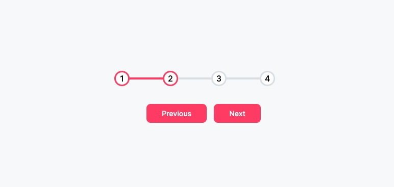

# js-Projects-50

- javascript ile oluşturduğum projelerden oluşmaktadır.

1. Proje animated pop-up cards

2. Proje animated progress steps

3. Proje Animasyonlu açılan menu

4. Proje Açılır kapanır arama kutusu

**5. Proje Animated Scroll:** ekran aşağı yukarı hareket ettikçe içerisindeki elementlerin animasyonlu bir şekilde erkranda görünmesi gerçekleştiriliyor.

**6. Proje Split landing screen:** hover efekti ile üzerine gelinen kısım büyürken diğer kısım küçülür.

**7. Proje Wave animation:**  input alanları aktif olduğunda içerisindeki label  dalga şeklinde yukarı çıkmaktadır.